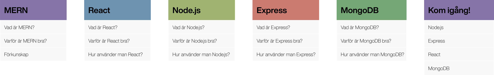

# Teknikutvärderingsrapport
Detta dokument är framplockat av två studenter vid Umeå Universitet som läser kursen Applikationsutveckling för Internet. Syftet med dokumentet är att ge en inblickande guide till hur utvecklingsstacken MERN är uppbyggd samt hur man går tillväga för att skapa ett nytt projekt.

Dokumentet är uppdelat i olika sektioner för att ge en bättre förståelse för hur de olika delarna är uppbydda samt vart koden exekveras. Vi väljer att titta på stacken från "front-end" sidan och arbetar oss sedan igenom stacken för att sedan avsluta med att förklara hur databasen är uppbyggd.



## MERN
### Vad är MERN?
MERN stacken är uppbydds av följande komponenter:
Verktyg | Beskrivning
:--- | :---
**M**ongoDB | Databas
**E**xpress | Ramverk som underlättar Node.js
**R**eact   | View
**N**ode.js | Controller & Model

#### Front-end
På klientsidan av programmet (view) arbetar **React**. Denna del ansvarar för UI som användaren möts av.

#### Back-end
På seversidan arbetar resterande program. **Node.js** gör det möjligt att exekvera JavaScript-kod direkt på servern. Utöver detta har plattformen väldigt många användbara tilläggspaket att utnyttja. Om du ska utföra någon specifik uppgift är det väldigt stor chans att någon annan redan skapat ett framework för att utöfra just denna uppgift. 

Ett av dessa paket är **Express**. Detta ramverk ansvarar framförallt för att förenkla kommunikationen mellan React och Node.js, men har även ytterligare funktionalitet.

**MongoDB** körs ofta på en separat server och fungerar som databas för att lagra data. **MongoDB Atlas** är en molnbaserad variant av databasen.

### Varför är MERN bra?
Den stora fördelen med stacken är att man kan bygga en full stack-webbapplikation utan att behöva växla mellan många olika språk. Det räcker med JavaScript och JSON.

MERN är väldigt populär på marknaden. Om du är utvecklare och söker jobb så har du goda chanser ifall du är bevandrad i dessa teknologier.

### Förkunskap
Det underlättar om man har grundläggande kompetens inom följande områden innan man börjar med MERN:
* **JavaScript** -  *Hela stacken bygger på detta språk. Om man har tidigare koderfarenhet men är novis inom JavaScript kan det vara en idé att lära sig [async/await](https://www.youtube.com/watch?v=PoRJizFvM7s) och [arrow functions](https://www.youtube.com/watch?v=u4URamXstM0).*
* **JSON** - *Lättviktat språk som används när man skickar data mellan klient, server och databas. Se en introduktion [här](https://www.youtube.com/watch?v=wI1CWzNtE-M&t=1241s).*
* **HTTP** - *Då man kommer att skicka och ta emot HTTP-meddelanden bör man känna till protokollets uppbyggnad. Se en överblick [här](https://www.youtube.com/watch?v=iYM2zFP3Zn0).*

## React
### Vad är React?
React.js är ett JavaScript-**bibliotek** som används för att bygga webbgränssnitt -  det vill säga färdiga funktioner redo att användas för utvecklare. Biblioteket utvecklades av företagen Facebook samt Instagram och är släppt med öppen källkod. Om vi tittar till designmönster MVC (Model - View - Controller) ser vi att React befinner sig under View-delen. Det vill säga, allt UI som användaren möts av när hen öppnar applikationen är uppbyggt med hjälp av React.

### Varför är React bra?

#### Components
React använder sig av komponenter för att uppdatera gränssnitttet. I stor sett allt som ska visas för användaren går att betrakta som en kompnenent. Ett exempel på en komponent skulle kunna vara en profilbeskrivning i ett socialt nätverk. När man laddar sidan för att läsa specifikationen om en person laddas informationen upp som en komponent. Det vill säga, informationen inhämtas från databasen och react uppdaterar sedan HTML filen genom att rendera innehållet till webbsidan.

#### Virtual DOM
Virtual DOM (Document object Model) är en direkt representation av ett DOM objekt. Det virituala dokumentet går att se som en kopia av orginal dokumentet. När en förändring sker i gränssnittet (UI) jämför webbapplikationen förändingen som skedde mellan orginal dokumentet samt det virituella dokumentet. Detta gör att applikationen exekveras snabbt samt gör det möjligt att endast uppdatera specifika delar av gränsnittet istället för att behöva skapa en helt ny layout av HTML filen.

#### JSX
JSX står för Javascript XML och är ett HTML samt XML "extension" (utvecklingspaket) till React. Detta paket underlättar hanteringen när det kommer till att skriva komponenter i React.

#### Redux
Denna del kan ses som en aning komplicerad och svårförståelig om man ej tidigare utvecklat med React. (Om du ej tidigare utvecklat med React och känner att du har svårt att greppa konceptet med hur React fungerar skulle jag avråda dig ifrån att lägga ner alldeles för mycket kraft på att förstå detta segment innan du testat på React och förstått grunden).
Redux är ett extension som används för att underlätta hanteringen av data inom applikationen. Det finns inget krav på att använda sig av denna extension. Om webbapplikationen ej är uppbyggd med någon större datahantering kan det vara att föredra att ej använda sig av denna modell. Översiktligt kan man beskriva Redux som ett moln som finns ovanför applikationslagret som gör det möjligt för olika delar av applikationen att komma åt data. Som ett expemel kan det vara bra för en del av applikationen att komma åt en profilbild som är länkad till en viss profil. En miniatyr denna profilbild kanske sedan ska anvädas när en sökning av användare utförs. Istället för att måste gå igenom flera "lager" innan man kan plocka fram denna bild gör Redux det möjligt för alla komponenter inom applikationen att få tillgång till det som lagras där. Det blir en aning komplicerat innan man förstått uppläget men när man väl förstått konceptet är det väldigt användbart samt tillför ett bättre struktur till koden. 
Redux används för att underlätta datahanteringen inom applikationen. 

Användningen av dessa olika extensions samt komponenter gör React till ett väldigt kraftigt utvecklingsverktyg. När man väl förstår sig på hur React fungerar är det möjligt att utveckla sin kunskap genom att börja använda sig av React Native. Med detta verktyg kan man utveckla Android samt IOS baserade applikationer.

### Hur använder man React?
Ett expel på hur det skulle kunna se ut när man ska uppdatera son HTML sidan men någon information går att se i följande kod:
```javascript
//Börja med att importera React samt React-dom för att kunna använda sig av dess funktionalitet
import React from "react";
import ReactDom from "react-dom";

//Skapa sedan en klass (komponent) som ska uppdatera HTML filen
class Layout extends React.Component {
  render() {
    return (
      <h1> Detta är en komponent som kommer uppdatera hemsidan med en rubrik </h>
    );
  }

//Om vi sedan säger att vi har en tagg vid namn applikation i HTML dokumentet så uppdaterar vi informationen under den sektionen genom följande kod. Vi börjar med att hämta objektet vid namn applikation och placera detta i en variabel
const applikation = document.getElementById('applikation');

//Vi uppdaterar (renderar) sedan dokumentet med vår nya rubrike genom att skicka in komponenten till det hämtade aplikationsdokumentet.
ReactDOM.render(<Layout/>, applikation);
```
I den nya uppdateringen av React är det dock möjligt att uppdatera komponenter genom att använda sig av något som kallas **React Hooks**. Detta tillägg gör att man ej behöver skapa separata klasser för att uppdatera en komponent, man skapar istället endast funtioner som uppdaterar komponenterna. Kodmässigt blir det mindre jobb samt mer strukturerat när man anväder sig av hooks. Men ur ett utlärningssyfte kan det vara mer intuitivt att först förstå upplägget genom klasser som komponenter.

## Node.js 
### Vad är Node.js?
Node.js är inte ett programmeringsspråk likt C#. Det är inte heller ett ramverk likt ASP.NET.
Node.js är en körbar miljö som kan exekvera JavaScript. Det används som ett API mellan vyn och databasen i webbapplikationer. Förrutom att kunna köra JavaScript back-end består Node.js av ett antal core modules.

#### Core modules
Detta är moduler som finns direkt efter installationen av Node.js. Varje modul består av ett antal funktioner. Dessa funktioner innehåller den mest grundläggande funktionaliteten för Node.js. Exempel på core modules:

* **HTTP** *- Används för att kommunicera med en webb-klient.*
* **path** *- Gör att man kan navigera bland filer i den dator som kör Node.js. Sparar även information om filer.*
* **fs** *- (File System) Ger möjlighet att skapa filer och mappar.*

[Här](https://nodejs.org/dist/latest-v12.x/docs/api/) hittar du alla core modules.

#### Node package manager (npm)
Node.js är open-source vilket innebär att det finns mängder av paket skapade av tredjepartsutvecklare. Ett paket kan vara ett ramverk, bibiliotek eller andra verktyg och innehåller likt core-modulerna ett antal funktioner. Många paket bygger på core-modulerna eller på andra npm-paket. [Här](https://www.npmjs.com/) hittar du alla npm-paket.

### Varför är Node.js bra?
JavaScript är det vanligaste språket inom Front-end-utveckling och syftet bakom Node.js är att kunna använda JavaScript även Back-end. Node.js är tillsammans med ramverket Express är ett av de mest använda verktygen för Back-end-utveckling på marknaden.

Node.js är känt för att vara väldigt snabbt och effektivt. En anledning är att Node.js är singeltrådat (asynkront) vilket innebär att det är väldigt effektiv och snabb för mindre appar som inte kräver stora mängder beräkningar.

### Hur använder man Node.js?

#### Importera moduler/paket

För varje fil som ska använda en modul/paket, importera det genom:

```javascript
const path = require('path'); // Använd core-modulen path i aktuell fil
const express = require('express'); // Använd npm-paketet "express" i aktuell fil
const myFile = require('./myFile'); // Importera en fil som du själv har utvecklat
```

#### Använda moduler/paket

När önskade moduler/paket är importerade används dem genom de variabler de är satta till. För att använda `path`
skriver man till exempel `path.function()` där `function()` är en funktion i modulen `path`. För att se vilka funktioner som går att använda, gå in i modulens/paketets dokumentation på nätet.

#### Användbara paket

* **express** *- Ramverkt med funktioner som underlättar användningen av Node.js.*
* **express-validator** *- Funktioner som gör det möjlighet att validera data (lösenord, användarnamn etc) från vyn.*
* **npx** *- Gör det möjligt att använda React utan att installera det globalt på datorn.*
* **jsonwebtoken** *- Hjälper till att hålla koll på vem som är inloggad samt avgör vilka routes användaren har tillgång till*
* **bcryptjs** *- Verktyg för att kryptera lösenord.*
* **config** *- Ger möjlighet att spara globala variabler.*
* **gravatar** *- Hämtar en avatar om användarens email är kopplat till gravatar.*
* **request** *- Förenklar syntax i samband med HTTP-meddelanden.*
* **mongoose** *- Innehåller funktioner som underlättar gränssnittet mellan Node.js och MongoDB. Likt DAL:et i ASP.NET.*

* **concurrently** *- Gör det möjligt att köra React och Express samtidigt*
* **nodemon** *- Gör att man inte måste starta om servern vid varje ändring*

## Express
### Vad är Express?

Express är ett paket som installeras till Node.js via npm. Det Node.js's mest populära paket. Eftersom Node.js opererar back-end så är även Express back-end. Express är ett **ramverk** ovanpå Node.js - alltså en samling funktioner skrivna i Node.js. Utan dessa funktioner skulle utvecklaren behöva skriva stora mängder kod för simpla uppgifter. Funktionerna är vanligt förekommande och en funktion kan användas i många olika syften. Utvecklaren adderar sedan egen kod till dessa funktioner för att fylla applikationens specifika syfte och det är det som skiljer ett **ramverk** från ett **bibliotek** som endast består av färdiga funktioner. Express syfte i MERN-stacken är att göra det enkelt att ta emot HTTP-requests från front-end (React) och skicka tillbaka HTTP-respons. Express är alltså back-end-serverns API mot front-end.

### Varför är Express bra?

Express gör det enklare och snabbare att utveckla i Node.js.

Ett exempel är när front-end (React) skickar en HTTP-request. Då krävs följande kod utan Express:
```javascript
const server = http.createServer(function(req, res) {
  if (req.url === ’/’) {
    res.writeHead(200 { ’Content-Type’ : ’application/json’ });
    res.end(JSON.stringify(data));
  }
});
```
Med Express räcker denna kod:
```javascript
app.get('/', function(req, res) {
  res.send(JSON.stringify(data);
});
```

I fallet ovan slipper man en if-sats och man slipper skriva och fylla i Content-Type. I en applikation som hanterar ett tiotal olika typer av HTTP-meddelanden blir det snabbt mycket mer att hantera för utvecklaren.

### Hur använder man Express?

#### Request & Response

Som beskrivet ovan hanterar Express HTTP-förfrågningar från front-end (React). För att kunna använda express måste man först initiera en variabel för att ha tillgång till alla funktioner. 
```javascript
const app = express();
```
Sedan väljer man vilken typ av HTTP-förfrågan som tas emot, i fallet nedan är det en POST-förfrågan. Fyll sedan i till vilken route förfrågan skickas (i det här fallet '/login'). Inuti get-funktionen kan man sedan manipulera HTTP-requesten `req` och HTTP-response `res`.
```javascript
app.post('/login', function(req, res) {
  if (req.user.id === id) {
    res.send(JSON.stringify(error);
  }
  res.send(JSON.stringify(success);
});
```
#### Middleware

Om man vill kalla på en funktion direkt man tar emot en HTTP-request kan man använda middleware. Middleware är funktioner som har tillgång till HTTP-reqeust och HTTP-response-objekten.

* Express har inbyggd middleware
* Man kan bygga egna middleware
* Det finns tredjeparts middleware

I samband med att man tar emot en HTTP-request från klienten så kan man kalla på denna middleware-funktionen. I exemplet nedan kallar vi på en middleware-funktion `auth` innan requesten hanteras:
```javascript
router.post('/login', auth, (req, res) => {
  // Middleware har redan exekverats
});
```
Man kan även köra flera middleware-funktioner:
```javascript
router.post('/login', [auth, check], (req, res) => {
  // Middleware har redan exekverats
});
```
Exempel på när middleware är bra att använda är när en användare vill komma åt en privat sida låst endast till en användare. Middleware kan då kontrollera ifall användaren har tillträde till den sidan.

#### Routes
Express har en inbyggd router. Detta innebär att om man bygger en forum-applikation så kan man separera HTTP-förfrågningar (routes) om profilen i en fil och HTTP-förfrågningar om inlägg i en annan. När man kommer upp i ett antal HTTP-requests underlättar denna struktur.

## MongoDB
### Vad är MongoDB?
MongoDB är en "NoSQL" databas där varje tabell (om man drar paralellen till en relationsdatabas) är ett dokument uppbyggt av "key value pairs" (nyckelvärden) som liknar JSON.
### Varför är MongoDB bra?
Fördelen med MongoDB är att man kan anväda sig av dess skal vilket medför att man kan interagera med ett javascript interface. Detta medför att man kan skicka skapa, uppdatera, ta bort data etc från databasen direkt via javascriptkommandon. Eftersom att databasen är uppbyggd med hjälp av nyckevärden behöver man ej i förhand koppla ihop olika tabeller med Primary keys samt Foreign keys. På detta vis blir databasen mer flexibel och enklare att modifiera i efterhand. Största fördelen med MongoDB är dock att man kan kommunicera med den med hjälp av javascript, detta resulterar i att samtilga delar i MERN stacken är uppbyggd med javascript som grund.
### Hur använder man MongoDB?
```javascript
//Om vi har skapat ett objekt i en MongoDB databas kan vi tillexempel lägga in data genom att kalla på följande funktion
db.tabellnamn.insert
(
    //Data som placeras in är skrivet i JSON format där varje objekt innehar ett eget objekt ID
    {
        "id" : 1,
        "Name" : "Janne",
                "Lärosäte": "Umeå Universitet",
                "Intressen": "Trolleri"
    }
);
```
## Hur kommer jag igång?

### Node.js

* Installera node.js på din dator. [Länk](https://nodejs.org/en/)
* Öppna ett terminalfönster och navigera till en mapp där din applikation ligger/ska ligga.
* Installera npm:
```
npm init
```
* Detta skapar en fil `package.json` som fil lagrar namn, version och beroenden mellan olika installerade paket.
* Installera användbara npm-paket, till exempel:
```
npm i express express-validator bcryptjs config gravatar jsonwebtoken mongoose request
```
* Installera devDependencies som är npm-paket som hjälper endast under utveckling av applikationen, till exempel:
```
npm install -D nodemon concurrently
```
* Skapa din main-fil `server.js`, förslagsvis genom en editor, ex. Visual Studio Code.

### Express
* I `server.js` skriver du följande kod:
```javascript
// Importera ramverket så att det går att använda
const express = require('express');

// Tilldela Express till en variabel så att man kan använda Express-funktionerna
const app = express();

// Ta emot olika typer av HTTP-förfrågningar
app.get('/', function(req, res) {
  // Manipulera data i den mottagna HTTP-requesten
  // Interagera med databasen
  // Mängder med möjligheter
  // Skicka tillbaka en HTTP-response
});

app.post('/', function(req, res) {
  // Manipulera data i den mottagna HTTP-requesten
  // Interagera med databasen
  // Mängder med möjligheter
  // Skicka tillbaka en HTTP-response
});

// Lyssna efter HTTP-förfrågningar som i det här fallet skickas till port http://localhost:5000/
app.listen(5000);
```
* Back-end-servern är nu redo att användas. Teststarta servern genom att skriva i terminalen:
```
npm run nodemon server
```


### MongoDB
För att använda sig av den molnbaserade databasen MongoDB Atlas utför följande steg.

* Skapa en användare på hemsidan [MongoDB] (https://www.mongodb.com/cloud/atlas): (Om du endast ska bygga en prototyp behöver du ej någon betalvariant av tjänsten.

* Antingen väljer du att sköta uppkopplingen till databasen i server.js filen eller så väljer du att göra detta i en separat javascript fil för att hålla bättre kodstuktur. 

```javascript
//Börja med att implementera mongoose till filen
const mongoose = require('mongoose');

//Skapa sedan en funktion som sköter uppkopplingen. (använd dig utav "async samt await för att ej låsa upp tråden)
const connectDB = async () => {
  //utför uppkopplinen inuti en try catch för att hantera eventuella uppkopplingsproblem
  try{
    //Logga in på din MongoDB profil och klicka "connect" -> "connect your application" och kopiera URLsträngen. Fyll in dit           lösenord under <password> delen i stängen. Skicka sedan in denna stäng tillsammans med eventuella "deprications warnings"         fixar.
    await mongoose.connect(databasnyckel , {
      useNewUrlParser: true
    });
    
  catch(err){
    console.error(err.message);
    //Avsluta uppkopplingsförsöket med en nedstängning
    process.exit(1);
  }
};
```


### React
* Navigera till projektetmappen i din terminal och skriv:
```
bash ****** Windows-grej??
``` 
* Använd node package manager för att installera react:
```
npm install create-react-app --global
```
* Skapa sedan applikationen genom att skriva:
```
create-react-app applikationsnamn
```
* Alla filer som krävs för en grundläggande React-applikation är nu skapade i en mapp med applikationsnamnet. 
* Du kan nu teststarta applikationen genom att navigera till mappen med applikationsnamnet och skriv:
```
npm start
```
* För att köra React och Node.js samtidigt använder vi oss av devDependencies concurrently som installerades tidigare via npm. För att detta ska fungera, öppna filen `package.json` och lägg in följande kod i ´"scripts"´:
```javascript
"client": "npm start --prefix client", 
"dev": "concurrently \"npm run server\" \"npm run client\""
```
* Nu kan du starta React och Node.js från root-mappen genom följande kommando:
```
npm run dev
```
* Du kan nu även installera npm-paket som underlättar i React, till exempel (läs mer om paketen hos [npm](https://www.npmjs.com/)).:
```
npm i axios react-router-dom redux react-redux redux-thunk redux-devtools-extension moment react-moment
```

**Du är nu redo att utveckla en sprillans ny MERN-applikation!**
