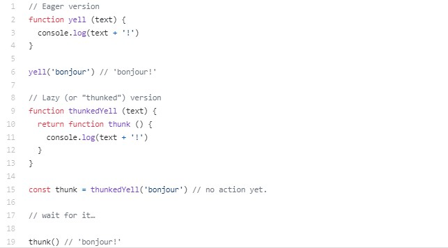

# MERN

## Överblick
Det som är bra med den här stacken är att man genomgående endast använder JavaScript och JSON.

Verktyg | Beskrivning
:--- | :---
**M**ongoDB | Databas
**E**xpress | Ramverk som underlättar Node.js
**R**eact   | View
**N**ode.js | Controller & Model

För att få en bättre överblick vilka program som exekverar vart kan vi titta på nedstående bild. 

På klientsidan av programmet (view) arbetar **R**eact. Denna del står för all UI som användaren möts av.

På seversidan arbetar resterande program. **N**ode.js och **N**ode package manager (npm) är ett open source plattform som exekverar på serversidan. Node.js gör det möjligt att exekvera javascriptkod direkt på servern (datorn), utöver detta har plattformen väldigt många användbara framework att utnyttja (om du ska utföra någon specifik uppgift är det väldigt stor chans att någon annan redan skapat ett framework för att utöfra just denna uppgift). 

Ett av dessa framework är **E**xpress, detta framework gör det möjligt att hantera POST, GET, DELETE osv på specifika "router" (http://janne/api/dennaroute). Utöver detta tillhandahåller den flera andra användbara funktionaliteter såsom att göra de möjligt att lägga in **M**iddleware, Middleware validerar om requesten samt responsen som skickas mellan server och browser är korrekt utformade.

**M**ongoDB körs ofta på en separat server och fungerar som databas för att lagra data. MongoDB **A**tlas är en molnbaserad databas som kan användas av alla som innhar nyckeln till databasern.

All kommunikation (data) som skickas mellan browser, server samt databas skickas i **J**SON format. JSON är ett kompakt textbaserat fomat som lämpar sig väl för att skickas mellan olika klienter.

I bilden till höger kan vi se att det finns två olika typer av backenddatabaser som kan byggas upp. Den ena **R**EST API hanterar varje route separat (dvs, en ny sida laddas upp till browser/klienten varje gång hen väljer att uppdatera). På motsvarande sätt går det att bygga upp en **G**raphQL API, denna har endast en statisk route men hanterar istället data via query kommandon.

<p float="left">
   
  
</p>

Det är även bra att kunna:
* **HTTP** - Hur protokollet är uppbyggt, meddelande-koder och typer av förfrågningar.

Några vanliga typer av felmeddelanden:
2xx - lyckad förfrågan | 3xx - vidarekoppling | 4xx - klientfel | 5xx - serverfel
:--- | :--- | :--- | :---
**200** - OK | **300** - Multiple Choices | **400** - Bad Request | **500** - Internal Server Error
**201** - Created | **301** - Moved Permanently | **401** - Unauthorized | **501** - Not Implemented
**204** - No Content | **302** - Found | **404** - Not Found | **503** - Service Unavailable

* **JSON** - Lättviktat språk som används när man skickar kod mellan tex. klient och server.
* **Postman** - HTTP-klient att testa sitt program med genom att skicka requests. Istället för att använda webbläsaren.
* **React Hooks** - Tillägg till React som gör det möjligt att skapa states utan att skapa en klass.
* **Redux** - Underlättar när man har mycket data i React. När man tex. vill dela states mellan komponenter.

### Förslag till filstruktur

* **server.js** *- Main-filen*
* **config/db.js** *- Koppling till databasen med hjälp av mongoose(?)*
* **config/default.json** *- *
* **middleware/** *- Mapp som innehåller egenskapade middleware-funktioner*
* **Models/** *- Mapp som innehåller alla modeller*
* **routes/api/** *- Innehåller alla HTTP-routes som kallas från klienten*

## React
Installera react i en ny mapp "client" genom att gå till din projektmapp och skriv in följande kommando:
```
npx create-react-app client
```
Installera sedan npm-paketet concurrently för att kunna köra React och Express samtidigt:
```
npm i concurrently
```
Lägg sedan in följande text i package.json:
```
"client": "npm start --prefix client",
"dev": "concurrently \"npm run server\" \"npm run client\""
```

Navigera till client-mappen och skriv följande kommande för att köra Express (servern) och React (klienten) samtidigt:
```
npm run dev
```

Användbara paket går att läsa om nedan:

* **axios** *- Andvänds för att göra HTTP Requests*
* **react-router-dom** *- Hanterar routingen inne i React, gör det möjligt att använda sig av dynamisk routing (routing som sker till flera olika sidor istället för endast en "single page*).
* **redux** *- Sparar alla "states" (objekt som kan förändras i din app tex en tickande klocka) i en global butik (eng. store, hehe). Redux gör det enklare att komma åt alla dessa "props" (värden som ska leverars neråt eller uppåt i applikationenn tex det uppdaterade klockslaget).*
* **react-redux** *- När fölk pratar om att man använder redux så pratar de oftas om båda dessa paketen. Egentligen så används endast redux till att spara saker i butiken (the store, hehe) medan react-redux låter dig koppla dessa "states" till olika komponenter inom react. Redux i sig vet inte ens om att react existerar*
* **redux-thunk** *- För att förklara thunk på en ganska hög nivå kan man beskriva det enligt följande: Av någon anleding vill man förkjuta en beräkning eller kodexekvering. Se bilden nedan som ett enkeklt exempel (För att kunna göra async-requests)*



* **redux-devtools-extension** *- Ett extension som gör det möjligt att se vilka "states" samt "props" som skickas i web browsern.*
* **moment** *- Ett extensin som underlättar när det kommer till att spara samt visa datum och tid i javascript*
* **react-moment** *- Samma som ovan i stort sett*
* **uuid** *- Genererar ett random ID.*


## Express
Express är byggt ovanpå HTTP modulen i node. Express gör det enklare att strukturera upp koden på ett bra sätt samt ger lite extra funktionalitet. 


### Middleware
Funktioner som har tillgång till HTTP-request och respons-objekt. 
* Express har inbyggd middleware
* Det finns ytterligare tredjeparts middleware
* Man kan bygga egna middleware

I samband med att man tar emot en HTTP-request från klienten så kan man kalla på denna middleware-funktionen. I exemplet nedan kallar vi på en middleware-funktion som heter auth innan requesten hanteras:
```javascript
router.get('/', auth, (req, res) => {
  res.send('Middleware function auth has been executed before this line');
});
```
Man kan även köra flera middleware-funktioner:

```javascript
router.get('/', [auth, check], (req, res) => {
  res.send('Middleware functions auth and check has been executed before this line');
});
```
## Node.js
Består av tre core-moduler:
* **HTTP** *- Används för att kommunicera med en web-klient.*
* **path** *- Kan navigera och hämta bland fil-rutter.*
* **fs** *- Kan skapa filer och mappar*

### Node Packet Manager (npm)
Gör det möjligt att installera tredjepartspaket. Alla paket finns att läsa om [här](https://www.npmjs.com/)  och nedan finns några exempel:
* **concurrently** *- Gör det möjligt att köra React och Express samtidigt*
* **nodemon** *- Gör att man inte måste starta om servern vid varje ändring*
* **bcryptjs** *- Verktyg för att kryptera lösenord*
* **config** *- Ger möjlighet att spala globala variabler*
* **express** *- Mängder funktioner som underlättar användningen av Node.js*
* **express-validator** *- Funktioner som gör det möjlighet att validera data (lösenord, användarnamn etc) från vyn*
* **gravatar** *- Hämtar en avatar om användarens email är kopplat till gravatar, lite som bitmoji*
* **jsonwebtoken** *- Hjälper till att hålla koll på vem som är inloggad samt avgör vilka routes användaren har tillgång till*
* **mongoose** *- Innehåller funktioner som underlättar gränssnittet mellan Node.js och MongoDB, motsvarar DAL*
* **request** *- Förenklar syntax i samband med HTTP-meddelanden*
* **npx** *- Gör det möjligt att använda React utan att installera det globalt på datorn.*

Installera alla samtidigt genom följande syntax i terminalen:
```
npm i express express-validator bcryptjs config gravatar jsonwebtoken mongoose request
```
Kör servern genom att navigera till rätt mapp och kör följande kommando:
```
npm run server
```

### promise/ async / await
Varje gång vi använder mongoose måste vi använda denna pga "it returns a promise" vad det nu innebär.
* **Promise** - Ett "Promise" är exakt vad det låter som. Ett promise är en funktion som tar in två variabler "(resolve, reject)". Funktionen uträttar sedan ansvaret det blivit tilldelad och om allting fungerade som det skulle returneras resolve med ett meddelande. Om funktionen av någon anledning ej kunde utföra sitt uppdrag eller något annat inträffade returneras reject med ett tillhörande meddelande. Funktioner som ska utföra tidskrävande uppgifter skrivs ofta som "promises" etersom att man då kan lägga till ett ".then" och uttöka med yttligare promisefunktioner. Dvs, promise1.then.promise2 osv.. Detta gör det möjligt att låta tidskrävande funktioner exekvera i bakgrunden (på APIet) och låter programmet/tråden utföra andra uppgifter medan den väntar.


* **Event Loop** - Innan vi sätter oss in i att förstå hur samt varför async och await fungerar är det viktigt att vi förstår grunderna inom javascript. En viktig aspekt med javascrips är att den jobbar på en singel tråd samt är asynkron (Asynkron kommunikation innebär att två skeenden interagerar med varandra men ej är tidsberoende av varndra. Ett sms är asynkron kommunikation eftersom mottagern ej behöver svara direkt på meddelandet medan ett telefonsamtal är synkron kommunikation). För att inte låsa upp gränssnittet när man kallar på en tidskrävande funktion anvädner sig javascript av den så kallade "Event loopen". Eventloopen innebär i stora drag att funtioner samt kommandon läggs på en stack som jobbar enligt (LIFO - last in first out). En viktigt aspekt att ha i åtanke är att javascript är singeltrådat men att en web browser arbetar med flera trådar. Detta betyder att vi kan kalla på en funtion som skickar en förfrågan till web APIet och sedan gå vidare till nästa kod att exekvera. När sedan web APIet har utfört sin uppgift skickar detta tillbaka sitt svar i form av en funktion och placerar detta i event kön (event queue). Denna funtion plockas sedan upp i stacken och exekveras när javascript tråden har tid. Nedan kan vi se en bild på hur javascript löser problemet när en timeput på 5000 ms sätts. 
[The event loop](https://www.youtube.com/watch?v=XzXIMZMN9k4/) - En kort video om hur even loopen fungerar.


* **Async** - Funtioner som returnerar ett "promise" märks som async. Detta medför att javascript förstår att kommunikationen som kommer att ske inom funktionen hanteras asynkront. Dvs, ett flertal funtioner kommer att deligeras över till web APIet och det är ej nödvändigt att vänta på deras svar och låsa upp tråden.

* **Await** - Denna funktion deklareras innan funtioner som kommer att returnera ett promise (kan endast användas inuti "async block"). Detta medför att "call stacken" vet om att den kan fortsätta till nästa kodrad i stacken utan att låsa upp sin tråd och vänta. 


## MongoDB

En fördel jämte relationsdatabaser är att man kan stoppa in data utan att på förhand bestämma namn typ osv på den data som ska sparas.

Man kan med ett funktionsanrop (mha mongoose!?) hämta ett objekt från servern och sedan skicka till klienten. Eftersom alla program förstår samma språk behöver inget parsas. Exempel:

```javascript
res.json(User.findById(req.user.id));
```

Det går självklart även att spara ned objektet från servern i ett JavaScript-objekt:

```javascript
let user = User.findById(req.user.id);
```

## Markdown language (.md)

* [Mastering Markdown](https://guides.github.com/features/mastering-markdown/) - En guide till språket
* [Syntax](https://github.com/adam-p/markdown-here/wiki/Markdown-Cheatsheet) - Markdown syntax
* [Template](https://gist.github.com/PurpleBooth/109311bb0361f32d87a2) - Exempel på README.md
* [Traversy](https://gist.github.com/bradtraversy/c831baaad44343cc945e76c2e30927b3) - Exempel på hur Brad Traversys .md
